## 光线追踪算法1

MG21330069 殷天润

## 实现功能

1. 学习了Ray tracing in one weekend,ray tracing the next week, ray tracing the rest of your life，实现了光线追踪算法，使用BVH中的AABB包围盒进行加速，借助蒙特卡洛以及重要性采样算法提高了采样的质量，让10采样的情况下的图片也能达到一定的质量。
2. 物体上：实现了球体，可以运动的球体，圆柱，三角形，三棱锥，圆盘，矩形；他们都实现了AABB包围盒；其中矩形和圆盘写了PDF概率密度函数以及对应的random函数，能够作为光源并且发挥重要性采样的效果，同时也允许多个光源；圆盘，圆柱，三角形三棱锥都允许任意的法相。
3. 材质上：实现了玻璃，金属，漫反射材质，并且实现了一部分的纹理和静态贴图
4. 摄像机允许定义位置，允许散焦模糊，光线实现了反走样，软阴影，处理了表面坏点。另外我也实现了旋转和平移操作。

## 项目编译

项目开发环境是ubuntu 20.04以及ubuntu 18.04，需要安装cmake，项目结构是:

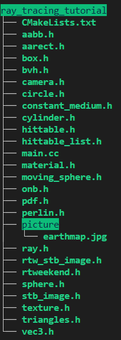

编译以及运行方法:

````bash
cmake .
make
./raytracer_in_one_weekend > test.ppm
````

为了便于测试，代码中的采样为10，速度很快。

另外可以通过 https://github.com/Tyler-ytr/ray_tracing_tutorial.git 获取代码。

## 问题描述

### 光线追踪

Ray Tracing光线追踪算法实际上是反向的。原理是：从摄像机开始发射光线，照射到物体上，由于物体的材质发生反射折射到像素点上，如果没有照射到物体上那就会返回背景的颜色，最后像素点对颜色进行平均。实际上对于每一个像素，摄像机都会向这个像素的随机位置”发射“多条光线，这些光线的均值就会作为像素点的颜色。事实上，发射的光线越多，也就是采样越高，那么成像的质量会越好。

上述这些原理进一步诱发了以下问题：

1. 光线照射到物体上会发生什么？不同材质下光线会有怎样的表现？怎么从算法层面进行加速？
2. 像素点导致的锯齿应该怎么解决？
3. 怎么让成像更加真实？

构建光线追踪的过程其实也就是回答上述问题的过程。

本报告及项目仅仅初步解决了这些问题，同时由于时间所限是实现在单核CPU上的，运行语言是C++，开发时通过cmake在ubuntu上编译运行。

## 解决思路

### 光线和物体

首先一根光线中的点可以通过$C(t)=\vec{O}+t\vec V$进行描述，其中O相当于光线发出的点，V是方向向量。对于光线和物体而言关键的是求出光线和物体的交点以及物体在交点向外（也就是光线这一侧）的法向量。之后材质部分就可以根据这些信息来计算光线的反射或者是折射。

加速的方法是通过BVH树来进行加速，核心思想是用一个很好算交点的盒子包住物体，光线打到盒子上才会进一步进行求交点运算，否则就可以略过这步了。整个数据结构为了查询速度构建成二叉树的形式，并且多个物体的包围盒也可以进一步合并进而进一步加快速度。对于每一种物体而言都需要知道如何依赖自身的信息构建包围盒。我是用的包围盒是AABB包围盒，构建包围盒需要知道物体的三维最小值和三维最大值，进而构建一个竖直的立方体进行包裹。

#### 平面

平面可以通过在平面上的点$P_0$以及平面的法向量$\vec n$进行描述，平面上面的任意一点P实际上都满足：$\vec P-\vec P_0=\overrightarrow{P_0P} \perp \vec n $，也就是$\overrightarrow {P_0P}\cdot \vec n =0$；然后和光线的参数方程进行联立（表示光线射到物体上）可以得到$(\vec{O}+t\vec V-\vec P_0)\cdot\vec n=0$，从而可以解得$t=-\frac{(\vec O-\vec P_0)\cdot \vec O-\vec n}{\vec B \cdot \vec n}$;（这里分母为0显然是不合法的）

然后需要判断t是否合法，需要根据平面进行区分的讨论：

- 对于圆面而言，只需要判断焦点到圆心的距离是否小于R就行了。圆面的法向量通过输入来确定（我的输入除了圆心之外还有一个远点，用圆心指向远点的向量来表示法向量）

- 对于三角面，通过这种方法进行求解的话有两种方法进行合法性判断，一个是同向法，另一个是重心法，具体可以参考[博客](https://www.cnblogs.com/graphics/archive/2010/08/05/1793393.html);

  另外1997年的论文《Fast, minimum storage ray-triangle intersection》有更加快速的三角形交点的求解方法，我在项目中参考了这篇[博客](https://www.i4k.xyz/article/weixin_43022263/108541782)的内容对该方法进行了实现。

  法向量可以通过三角形边的叉乘来进行确定。

然后是包围盒的部分：

- 对于圆面而言，首先通过它的法向量可以和比如(0,0,1)或者(0,1,0)进行叉乘得到圆面上面的一个向量称为$\vec A$，然后$\vec A$和法向量进一步叉乘可以得到圆面上面的另一个向量$\vec B$，这两个都可以取单位向量。然后通过这两个向量就可以构建一个正方形包裹住圆面，然后通过这四个坐标就可以求得需要的两个极值点了。（如果两个极值点的某一个维度相等，需要加一个类似于0.001的值防止包围盒贴合）
- 对于三角形而言，直接通过三个点的坐标求极值点就行了。

#### 圆柱

求交点的方法：

1. 光线的表达式为:$C(t)=\vec{O}+t\vec V$;

2. 假设一个圆柱的底面圆心是顶面圆心是$\vec O_1$，顶面圆心是$\vec O_2$，半径是R；那么可以得到底面往上的单位向量$\vec N$是$\frac{\overrightarrow{O_1O_2}}{||\overrightarrow{O_1O_2}||}$;

3. 已知叉乘$\vec a\times \vec b=||\vec a||||\vec b|| sin\theta$

4. 现在考虑C与圆柱侧面相交的情况；

   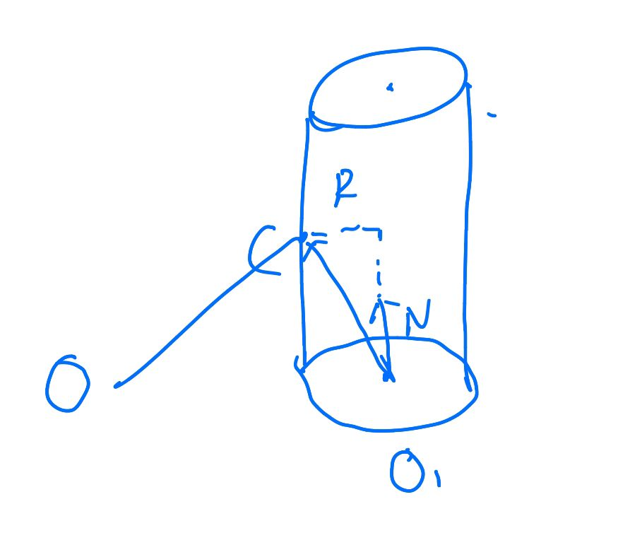

   根据上面一条3叉积的定义不难发现：
   $$
   (\overrightarrow{O_1C}\times \vec N)=R^2
   $$
   由于$\vec C$是关于t的一个表达式，那么可以把上面的公式表示成一元二次方程$at^2+bt+c=0$;其中:

   - $a=(\vec V\times \vec N)^2$
   - $b=2(\vec V\times \vec N)\cdot(\overrightarrow{O_1O}\times \vec N)$
   - $c=(\overrightarrow{O_1O}\times \vec N)^2-R^2$

   假设方程的根为$t_1,t_2(t_1<t_2)$：

   - 如果$0<t_1<t_2$，那么$t_1$可能为解
   - 如果$t_1<0<t_2$，那么光源在圆柱内，t_2可能为解
   - 如果$t_1<t_2<0$说明无解；

   把上面的解带入$C(t)$，然后判断$(\overrightarrow{O_1C}\cdot \vec N_1)>0 ~\&\&~(\overrightarrow{O_2C}\cdot \vec N_2)>0$来保证交点在圆柱的高度范围内

5. 如果是和圆柱底面或者顶面相交：

   使用上面提到的方法进行求解交点

6. 比较第4步和第5步的t，取最小值为实际交点对应的t

求包围盒的办法：

- 圆柱通过上下两个底面根据平面中的圆面求包围盒的方法可以得到八个顶点，然后用这八个顶点求极值点即可。

#### 球体

求交点的方法：

- 这里通过球心到球面的是距离是R的原理，结合光线方程的方法进行求解，这两个性质可以得到相对于t的一元二次方程:
  $$
  (\vec O+t\vec V-\vec C)^2=R^2
  $$
  如果一元二次方程无解说明不存在交点，如果存在解 选择t值小的解即可（远处的被遮挡了）；

  法向量就是球心指向交点的向量。

#### 三棱锥

可以用四个顶点构建四个三角形面片，进而可以求交点和对应的法向量；包围盒通过四个顶点就可以求到极值点

### 光线和材质

上面一部分可以得到交点以及物体在这个交点对应的法向量，物体的材质决定了发出的光线。这里对于物体而言主要有两种情况，光线会进行折射或者反射。

---------------------

如下图是维基百科的例子：

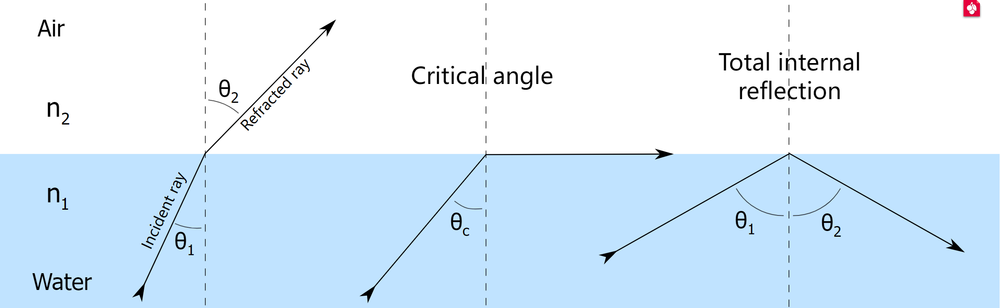

#### 反射

对于反射而言，假设入射光线是$\vec v$，出射光线是$\vec v'$。入射光线可以根据平行或者垂直平面分解为$\vec v_{\perp}$以及$\vec v_{\parallel}$;假设平面的法向量是$\vec n$，那么可以得到$\vec v_{\perp}=(\vec v\cdot \vec n)\vec n$；显然，出射方向这个分量的方向就是$-\vec v_{\perp}$；然后出射光的平行的部分保持不变，所以有:
$$
\vec v'=\vec v'_{\parallel}+\vec v'_{\perp}=\vec v_{\parallel}-\vec v_{\perp}=\vec v_{\parallel}+\vec v_{\perp}-2\vec v_{\perp}=\vec v-2(\vec v\cdot \vec n)\vec n
$$

#### 折射

这部分的理论依据是Snell法则:
$$
\eta\cdot\sin\theta=\eta'\cdot\sin\theta '
$$
在上图中$\theta$就是$\theta_1$，$\theta’$就是$\theta_2$。如果知道了$\theta'$就知道了折射防线的方向了。

这里使用书上的结论，将出射光$R'$拆成$R'_{\perp},R'_{\parallel}$，假设法向量是$N$，并且他们都是单位向量，有:
$$
R'_{\parallel}=\frac{\eta}{\eta'}(R+\cos\theta N)=\frac{\eta}{\eta'}(R+(-R\cdot N) N)
$$

$$
R'_{\perp}=-\sqrt{1-|R'_{\parallel}|^2}N
$$

$\eta$与介质性质有关，比如玻璃是1.5，空气是1.0。

-----------------

#### 其他部分

对于特定的材质而言，还有可能需要考虑的是光线吸收了多少(attenuate)以及是否有漫反射等等。如果发生漫反射的话，其中的一种做法是如下图:

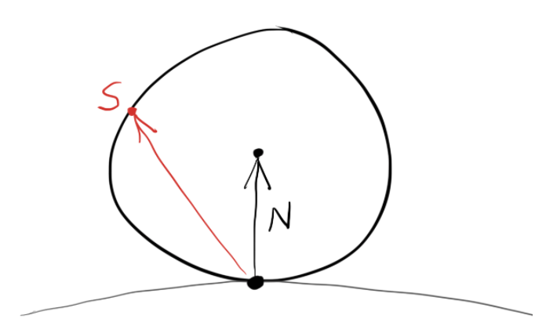

在光线与物体的交点的法向量那一侧首先生成一个单位球，然后在这个球面上生成一个随机的向量作为出射的光线。

另外材质还可能有纹理，比如全球的地图或者柏林噪声等等。这块其实要求着对于物体表面特定的点要转换成二维坐标u,v进而对应纹理上面的坐标（显然纹理作为贴图是二维的）。

### 反走样

最基础的版本，光线相当于一个像素点射一次，这就会带来锯齿问题，因为像素点不一定只有中心所代表的颜色。从这个像素点的角度而言，为了更加精准就需要多次采样求均值，一个比较好的方法是把像素点进一步分割成多个小块然后在这些小块的随机位置射入光线最后求颜色平均值(jitter)。


### 蒙特卡洛算法和重要性采样

这部分是rest of life的内容，主要的目的在于让随机的过程（比如光源发光，漫反射）等等更加贴近物理世界，可以让较少的采样就能带来较好的结果。这部分要求实现PDF以及对应的随机分布的生成，我实现了圆面以及矩形用于光源采样，以及漫反射，金属，玻璃材质用来生成更加逼真的表面，时间所限这篇报告不再赘述。

## 测试案例以及效果演示

我搭建的场景是我进一步修改的康奈尔盒子:

````C++
    objects.add(make_shared<yz_rect>(0, 555, 0, 555, 555, green));
    objects.add(make_shared<yz_rect>(0, 555, 0, 555, 0, red));
    objects.add(make_shared<circle>(point3(278,554,279),point3(278,0,279),60,light));
    objects.add(make_shared<circle>(point3(500,500,500),point3(0,0,0),60,light));
    objects.add(make_shared<circle>(point3(60,500,500),point3(500,0,0),60,light));
    //objects.add(make_shared<flip_face>(make_shared<xz_rect>(213, 343, 227, 332, 554, light)));
    objects.add(make_shared<xz_rect>(0, 555, 0, 555, 555, white));
    objects.add(make_shared<xz_rect>(0, 555, 0, 555, 0, white));
    objects.add(make_shared<xy_rect>(0, 555, 0, 555, 555, white));
````

不同之处是里面都是圆形光源并且为了体现我实现了各个方向的圆形光源在盒子的两角加入了两个光源.

然后里面的物体是金属盒子（镜面反射），斜在空中的圆柱（体现我实现了任意方向的圆柱）材质是白色的lambertian，一个蓝色的lambertian正三棱锥，然后是三个小球，包括了一个地图贴图球，玻璃球以及动态模糊的lambertian球。

````c++
    shared_ptr<material> aluminum = make_shared<metal>(color(0.8, 0.85, 0.88), 0.0);
    shared_ptr<hittable> box1 = make_shared<box>(point3(0,0,0), point3(120,330,120), aluminum);
    box1 = make_shared<rotate_y>(box1, 10);
    box1 = make_shared<translate>(box1, vec3(400,0,295));
    objects.add(box1);

    shared_ptr<hittable> cylinder1 = make_shared<cylinder>(point3(0,0,0), point3(120,120,120),50,white);
    cylinder1 = make_shared<rotate_y>(cylinder1, -18);
    cylinder1 = make_shared<translate>(cylinder1, vec3(160,230,80));
    objects.add(cylinder1);

    shared_ptr<hittable> pyramid1=make_shared<pyramid>(point3(0,140,0),point3(-1.44*70,0,-1.44*70),point3(140,0,0),point3(0,0,140),blue);
    pyramid1 = make_shared<rotate_y>(pyramid1, 70);
    pyramid1 = make_shared<translate>(pyramid1, vec3(150,0,350));
    objects.add(pyramid1);

    auto glass = make_shared<dielectric>(1.5);
    objects.add(make_shared<sphere>(point3(350,90,190), 50 , glass));

    objects.add(make_shared<sphere>(point3(410,50,120), 50 , earth_surface));
    auto moving_sphere_material = make_shared<lambertian>(color(0.7, 0.3, 0.1));
    vec3 center1 = point3(290, 140, 260);
    objects.add(make_shared<moving_sphere>(center1, center1+vec3(30,0,0), 0, 1, 50, moving_sphere_material));

````

其中光线迭代次数都是50次。

以下是实验结果，包含了10采样(几十秒)，200采样(分钟级别)，1000采样(分钟到小时级别)：

- 10采样:

  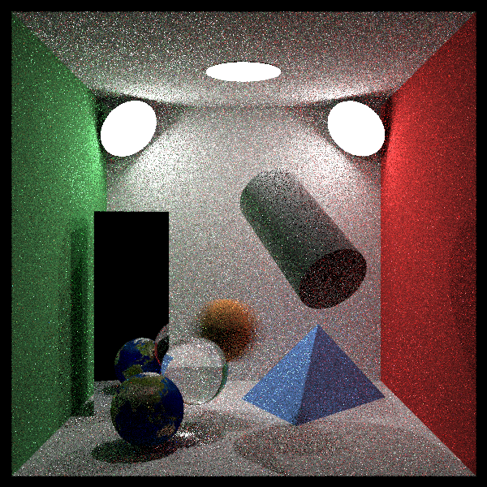

- 200采样:

  

- 1000采样:

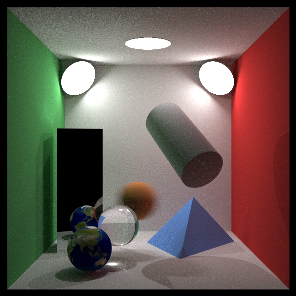

#### ps

- 不错的获取三维坐标的网站：https://www.geogebra.org/3d

# 光线追踪算法2——采样

MG21330069 殷天润

## 项目编译

项目开发环境是ubuntu 20.04以及ubuntu 18.04，需要安装cmake，项目结构是:

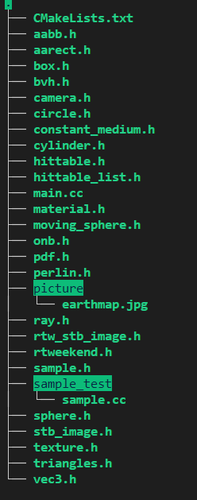

编译以及运行方法:

````bash
cmake .
make
./raytracer_in_one_weekend > test.ppm
````

另外，在sample_test文件夹：

````bash
cd sample_test
g++ sample.cc
./a.out
````

可以获得sample类输出的点，调试sample(1,2)括号里面的参数就可以选择不同的采样方式

另外可以通过 https://github.com/Tyler-ytr/ray_tracing_tutorial.git 获取代码。


## 问题描述

这次需要进行的工作是采样方面的修改，实现三种采样并且进行比较；因此这次主要有三个部分，第一个是实现采样算法到特定的类中，第二个是在现有的框架中加入采样算法，第三个是对不同的采样算法进行比较。

**对于第一部分**，本次作业我实现了uniform，random（jitter版本）以及快速泊松采样

**对于第二部分**，在本项目中，采样主要在两个部分进行，一个是在main.cc中，这部分是对画面的像素块进行采样；另一部分在光源的（目前的光源有circle,xz_rect）random函数中，这部分相当于是对漫反射的光线的位置做采样；具体如下文所述。

对画面的像素块进行采样的Render部分处于main.cc中的最后一部分的for循环部分，这部分在没有进行修饰的情况如下:

````c++
    std::cout << "P3\n" << image_width << ' ' << image_height << "\n255\n";
    for (int j = image_height-1; j >= 0; --j) {
        std::cerr << "\rScanlines remaining: " << j << ' ' << std::flush;
        for (int i = 0; i < image_width; ++i) {
            vec3 color(0, 0, 0);
            for (int s = 0; s < samples_per_pixel; ++s) {
                auto u = (i + random_double()) / image_width;
                auto v = (j + random_double()) / image_height;
                ray r = cam.get_ray(u, v);
                color += ray_color(r, background, world, lights,max_depth);
            }
            color.write_color(std::cout, samples_per_pixel);
        }
    }
````

这部分代码实际上是从画面的左上角遍历像素块，每一个像素块里面随机的采样s次，然后采样的点输入的摄像机中（经过散焦模糊）生成光线，然后交给`ray_color`函数计算光源，反射等影响，最后做平均化。上面的是之前的代码，在上面的函数中可以看出，原始版本是Random Sampling。

对漫反射的光线的位置做采样的部分，在对应的类的random函数中，比如circle在没有进行修饰过的版本如下：

````c++
        virtual vec3 random(const point3& origin) const override{
            double r = sqrt(random_double());//0-1随机数
            double theta=random_double(0, 1)*2*pi;//随机角度
            //生成两个垂直于法向量的单位向量构成坐标系来解决
            vec3 OP_unit=vertical_unit_vector(N);
            vec3 OQ_unit=cross(OP_unit,N);
            vec3 randompoint=center+r*cos(theta)*OP_unit+r*sin(theta)*OQ_unit;
            return randompoint-origin;
        }
````

这部分是生成单位球里面的一个随机点。可以看出原始的版本也是Random Sampling。另外，random对应的pdf应该是不用修改的。

本作业的内容主要是修改这部分功能里面的采样部分，以期获得更好的软阴影效果。

**对于第三部分**，本次作业我对三种采样在若干场景中进行了渲染并且进行比较。

## 解决思路

### 采样算法实现

#### 蓝噪声实现算法

这部分实现参考Fast Poisson Disk Sampling in Arbitrary Dimensions中的算法。下面对该算法进行介绍：

该算法主要是为了在O(N)的时间里面生成N个泊松圆盘采样，算法的输入是样本域$R^n$以及样本之间的最小距离以及一个常数k作为算法中剔除前要选择的样本的限制。

- 第零步：初始化n维的背景网格用来存储样本和加速空间搜索。这里算的以$r/\sqrt{n}$为界作为单元的大小，这样每一个网格但与最多包含一个样本，因此网格可以是现成一个简单的n维整数数组：默认是-1表示没有样本；或者一个非负的整数给出在这个单元中采样的索引。

- 第一步：在域中随机的选择初始的样本$x_0$，把它插入到后台的网格中，并且使用这个索引（零）初始化”active list"（候选点的集合）

- 第二步：当候选点的集合非空的时候，从里面选择一个随机的索引，称作i；在$x_i$附近随机的生成最多k个点，这些点在半径r到2r的球形环空间里面均匀选择。对于每一个点，检查它是否在现有样本的距离r里面，如果某一个点和现有的样本相聚特别远，那么把它作为下一个样本发出，并且把它插入到候选点的集合里面。如果在k次尝试之后没有找到符合要求的点，就从候选点的列表里面删除i。

#### 算法封装

我在`sample.h`中封装了sample类，可以通过修改`sample_type`参数来进行不同的采样（0:uniform 1:random 2:Fastpoisson）;对外的参数还有threshold，这表示的是在100*100的图里面，采样的点之间的最小距离；输出的是采样的二维的点的做好了正则化的vector；

我通过[desmos](https://www.desmos.com/calculator) 对效果进行了可视化输出，下面是threshold为5的时候的具体的效果：

1. uniform 采样

   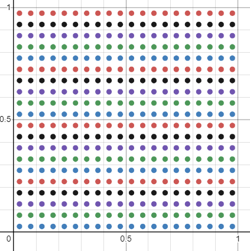

2. random(jitter)采样

   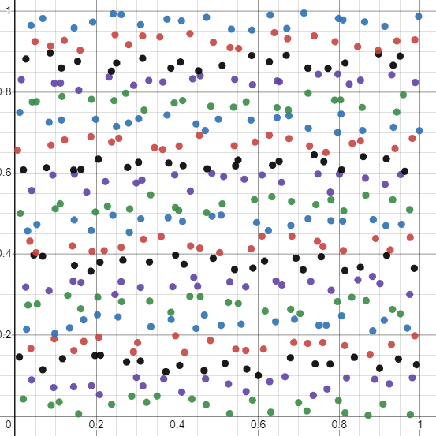

3. 快速泊松采样：

   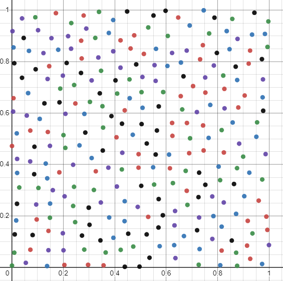

   

### 现有框架加入采样算法

#### 像素块采样修改

这部分我的修改就是在main函数中添加了`sampler`，然后把之前固定的采样次数转换成了生成的随机列表的大小，然后做平均化

````c++
    Sampler sampler(sample_threshold,sample_type);
    std::vector<std::pair<double,double>> randomlist;
    int samples_per_pixel=10;//10为默认参数没有意义
    std::cout << "P3\n" << image_width << ' ' << image_height << "\n255\n";
    for (int j = image_height-1; j >= 0; --j) {
        std::cerr << "\rScanlines remaining: " << j << ' ' << std::flush;
        for (int i = 0; i < image_width; ++i) {
            vec3 color(0, 0, 0);
            randomlist=sampler.sampling();
            samples_per_pixel=randomlist.size();
            for (int s = 0; s < samples_per_pixel; ++s) {
                auto u = (i + randomlist[s].first) / image_width;
                auto v = (j + randomlist[s].second) / image_height;
                ray r = cam.get_ray(u, v);
                color += ray_color(r, background, world, lights,max_depth);
            }
            color.write_color(std::cout, samples_per_pixel);
        }
    }
````

#### 光线采样修改

这部分我的思路是在circle中添加`sampler`以及`random list`，还有`random_index`，首先在生成circle类的时候预先生成一个采样列表，然后在实际采样的时候直接使用列表里面的采样点，并且把`random_index`加一；如果这个列表都采样完了那就重新再采样一轮。

````c++
        virtual vec3 random(const point3& origin)  override{
            sample_cnt=sample_cnt+1;
            if(sample_cnt==sample_size){
                re_sample();
            }
            
            double r = sqrt(randomlist[sample_cnt].first);//0-1随机数
            double theta=2*pi*randomlist[sample_cnt].second;//随机角度

            vec3 OP_unit=vertical_unit_vector(N);
            vec3 OQ_unit=cross(OP_unit,N);
            vec3 randompoint=center+r*cos(theta)*OP_unit+r*sin(theta)*OQ_unit;
            return randompoint-origin;
            
        }
        void re_sample(){
            randomlist=sampler.sampling();
            sample_cnt=0;
            sample_size=randomlist.size();
        }
````

### 采样比较

我生成了棋盘场景以及cornnel场景；

在实验1中，采样模式的修改包括了上述的光线采样以及像素块采样两种的修改，像素块采样部分threshold的参数为1（光线采样部分为5，这样的设计如果是uniform的话，相当于像素块部分采样$100*100=10000$次，光线部分的预采样长度为$20*20=400$次）；

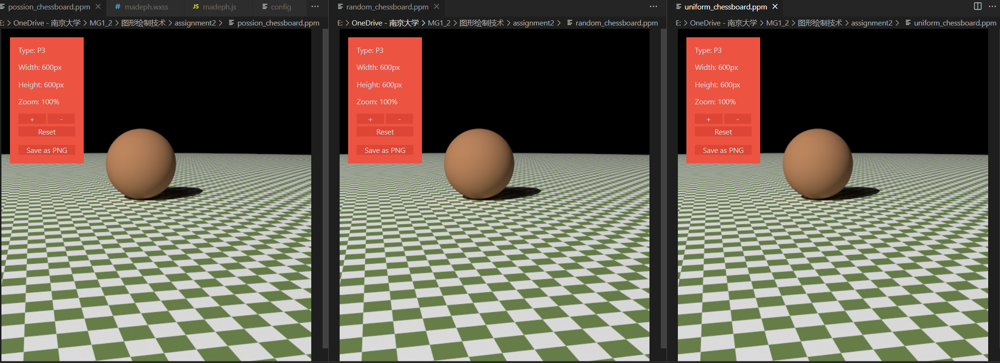

从左到右是快速泊松，随机（jitter）和uniform；

在这种高采样的场景下三种模式表现比较相似；

我替换场景之后再cornnelbox的场景下面再次进行了实验：

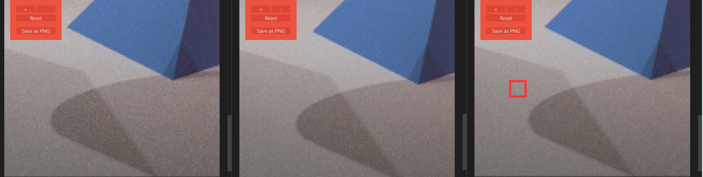

从左到右依然是快速泊松，随机(jitter)和uniform；uniform中存在框出来的这种小亮点。

他们的阴影效果略有不同，相反我观察到快速泊松的不如jitter柔和，我认为是因为我的算法中，在设置threshold为1的时候快速泊松的采样次数（某一次测试为6475）不如后两者（10000）次多导致的。


#### PS

- [好用的画图网站desmos](https://www.desmos.com/calculator)

## 光线追踪算法3——BRDF以及混合PDF

MG21330069 殷天润

### 项目编译

项目开发环境是ubuntu 20.04以及ubuntu 18.04，需要安装cmake；

编译以及运行方法:

````bash
cmake .
make
./raytracer_in_one_weekend > test.ppm
````

另外可以通过https://github.com/Tyler-ytr/ray_tracing_tutorial.git 的assignment3分支获取代码

### 问题描述

本次实验需要实现多边形光源，支持BRDF模型以及实现MIS采样；

### 解决思路

### 多边形光源及光源采样

多边形光源可以理解为多个三角形光源拼起来的，因此首先需要解决三角形光源；

假设三角形的三个点是A,B,C，那么光源采样的方程是：
$$
a_1=random\_uniform(0,1)\\
a_2=random\_uniform(0,1)\\
u=1-\sqrt{a_1}\\
v=a_2\sqrt{a_1}\\
P=u*A+v*B+(1-u-v)*C
$$
PDF计算的方法：

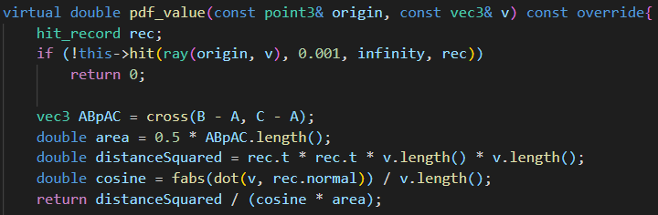

现在解决了三角形光源的问题之后，就是怎么根据输入的点$(x_1,x_2,...,x_n)$来正确的生成三角形了；

我使用的方法是生成$(x_1,x_2,x_3),(x_1,x_3,x_4),...,(x_1,x_{n-1},x_n)$这些三角形来构成多边形，六边形情况如下图：

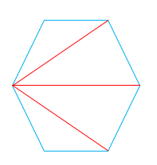

这部分存在的问题是可能三角形的法相是反的，产生的错误效果就是光源变成了黑色；

### 圆形光源的光源采样

圆形光源采样第一次实验的时候就已经实现，采样的公式如下：
$$
r=\sqrt{random\_uniform(0,1)}\\
\theta = random\_uniform(0,2\pi)\\
OP\_unit=vertical\_unit\_vector(N)\\
OQ\_unit=cross(N)\\
randompoint=center+r*cos(theta)*OP_unit+r*sin(theta)*OQ\_unit;
$$
PDF的计算方法如下：

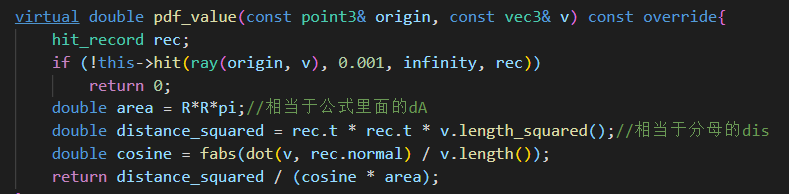

### Microfacet BRDF实现

这部分实现比较困难，我学习了GAMES101的Lecture13-17再次加深了BRDF的概念，参考了[Article - Physically Based Rendering - Cook–Torrance](http://www.codinglabs.net/article_physically_based_rendering_cook_torrance.aspx )以及文献Microfacet Models for Refraction through Rough Surfaces；

首先要考虑的现实问题是这部分应该放在现有框架的位置；

main函数中ray_color的部分如下图，其中attenuation可以理解为颜色，pdf_val是混合PDF计算出来的值，由于attenuation计算的时候实际上还没有生成scattered也就是随机往外的光线的方向，因此BRDF实际上应该实现在$scattering\_pdf$模块里面；

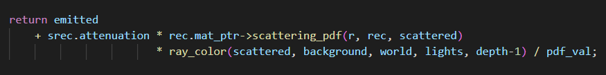

这个模块的位置在material里面，因此我新建了一个叫做microfacet的material来进行这块的工作；

现在考虑Cook-Torrance BRDF方程：

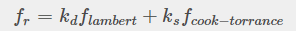

其中$k_d.k_s$实际上是颜色，在我的实现中，这两种颜色一样（实际上就是attenuation里面记录的颜色），因此$scattering\_pdf$里面现在需要计算的值是$f_{ lambert}+f_{cook-toorance}$；

前者表示的是macrosurface，相当于是那种flat & rough的面；后者表示的是bumpy & specular的microscale；


$f_{ lambert}$这部分的计算比较简单，照搬之前lambert材质的实现就行了：

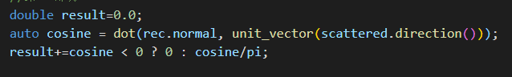

$f_{cook-toorance}$比较复杂，最基本的公式如下图：

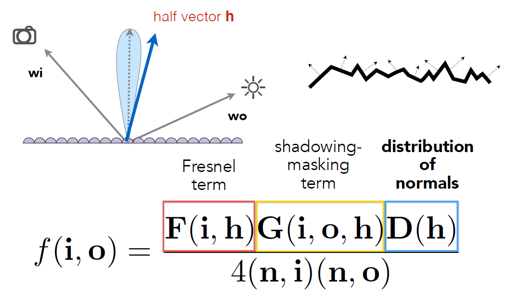

其中h表示的是入射和初始光线相加之后得到的”中间“向量；这个公式由三个部分组成，分别是F,G,D；

F表示的是菲涅尔项，”菲涅耳函数F用于模拟光以不同角度与表面相互作用的方式。“由于原版的比较复杂，实现中实际上用的是Shlick实现的比较简单的版本：

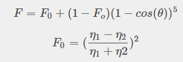

”几何函数G用于描述由于微小平面相互阴影而导致的光衰减。这又是一个统计近似值，它模拟了在给定点微面被彼此遮挡的概率，或者光线在多个微面上反弹，在此过程中失去能量，然后到达观察者的眼睛。“这部分使用的是GGX函数：

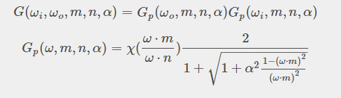

""分布函数D用于描述微观面在某个给定点的统计方向。例如，如果 20% 的分面朝向某个向量 m，则将 m 馈送到分布函数中将得到 0.2。文献中有几个函数来描述这种分布（例如 Phong 或 Beckmann），但是我们将用于分布的函数将是 GGX ”，其定义如下：

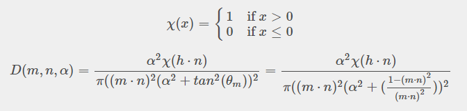

这三个函数最终我在框架中进行了实现，这里需要注意入射光线和出射光线的方向问题，如果没有考虑或者调试的话会造成奇怪的阴影效果，错误版本如下图：

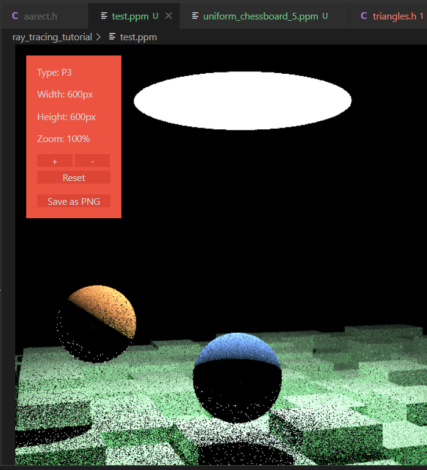

最后我成功进行了BRDF这部分的实现，上图的正确版本如下：

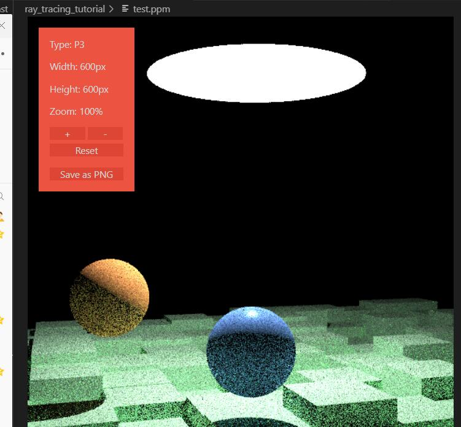

### 混合PDF实现

我在作业一的时候就实现了混合的PDF的实现，目前混合的比例是0.5：

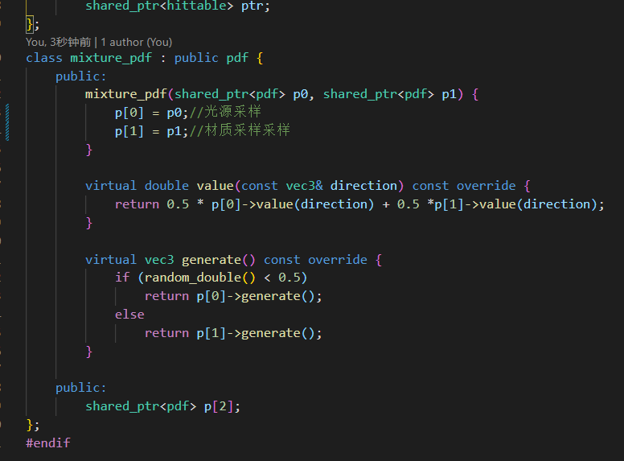

### 最终实现效果

100采样

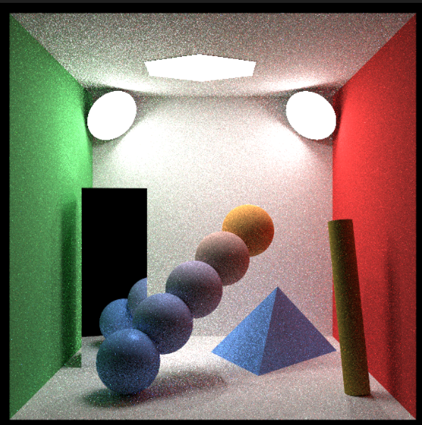

1000采样

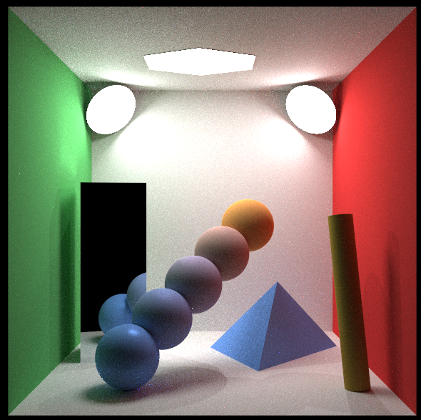

其中小球从下到上Microfast的粗糙度参数是0.1,0.3,0.5,0.7,0.9;因此是越来越粗糙；另外其他的除了镜面之外的材质的粗糙度都是0.6；

