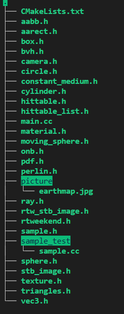
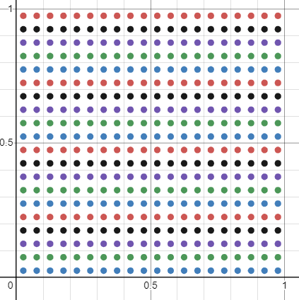
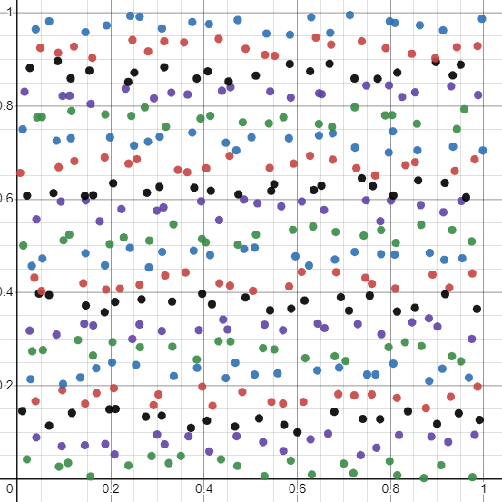
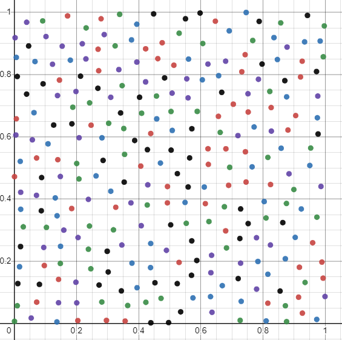
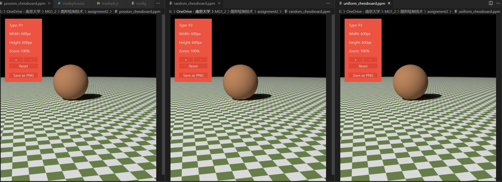
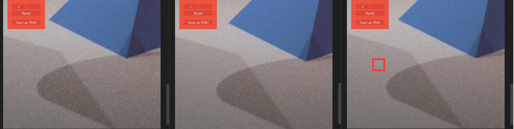

# 光线追踪算法2——采样

MG21330069 殷天润

## 项目编译

项目开发环境是ubuntu 20.04以及ubuntu 18.04，需要安装cmake，项目结构是:



编译以及运行方法:

````bash
cmake .
make
./raytracer_in_one_weekend > test.ppm
````

另外，在sample_test文件夹：

````bash
cd sample_test
g++ sample.cc
./a.out
````

可以获得sample类输出的点，调试sample(1,2)括号里面的参数就可以选择不同的采样方式

另外可以通过 https://github.com/Tyler-ytr/ray_tracing_tutorial.git 获取代码。


## 问题描述

这次需要进行的工作是采样方面的修改，实现三种采样并且进行比较；因此这次主要有三个部分，第一个是实现采样算法到特定的类中，第二个是在现有的框架中加入采样算法，第三个是对不同的采样算法进行比较。

**对于第一部分**，本次作业我实现了uniform，random（jitter版本）以及快速泊松采样

**对于第二部分**，在本项目中，采样主要在两个部分进行，一个是在main.cc中，这部分是对画面的像素块进行采样；另一部分在光源的（目前的光源有circle,xz_rect）random函数中，这部分相当于是对漫反射的光线的位置做采样；具体如下文所述。

对画面的像素块进行采样的Render部分处于main.cc中的最后一部分的for循环部分，这部分在没有进行修饰的情况如下:

````c++
    std::cout << "P3\n" << image_width << ' ' << image_height << "\n255\n";
    for (int j = image_height-1; j >= 0; --j) {
        std::cerr << "\rScanlines remaining: " << j << ' ' << std::flush;
        for (int i = 0; i < image_width; ++i) {
            vec3 color(0, 0, 0);
            for (int s = 0; s < samples_per_pixel; ++s) {
                auto u = (i + random_double()) / image_width;
                auto v = (j + random_double()) / image_height;
                ray r = cam.get_ray(u, v);
                color += ray_color(r, background, world, lights,max_depth);
            }
            color.write_color(std::cout, samples_per_pixel);
        }
    }
````

这部分代码实际上是从画面的左上角遍历像素块，每一个像素块里面随机的采样s次，然后采样的点输入的摄像机中（经过散焦模糊）生成光线，然后交给`ray_color`函数计算光源，反射等影响，最后做平均化。上面的是之前的代码，在上面的函数中可以看出，原始版本是Random Sampling。

对漫反射的光线的位置做采样的部分，在对应的类的random函数中，比如circle在没有进行修饰过的版本如下：

````c++
        virtual vec3 random(const point3& origin) const override{
            double r = sqrt(random_double());//0-1随机数
            double theta=random_double(0, 1)*2*pi;//随机角度
            //生成两个垂直于法向量的单位向量构成坐标系来解决
            vec3 OP_unit=vertical_unit_vector(N);
            vec3 OQ_unit=cross(OP_unit,N);
            vec3 randompoint=center+r*cos(theta)*OP_unit+r*sin(theta)*OQ_unit;
            return randompoint-origin;
        }
````

这部分是生成单位球里面的一个随机点。可以看出原始的版本也是Random Sampling。另外，random对应的pdf应该是不用修改的。

本作业的内容主要是修改这部分功能里面的采样部分，以期获得更好的软阴影效果。

**对于第三部分**，本次作业我对三种采样在若干场景中进行了渲染并且进行比较。

## 解决思路

### 采样算法实现

#### 蓝噪声实现算法

这部分实现参考Fast Poisson Disk Sampling in Arbitrary Dimensions中的算法。下面对该算法进行介绍：

该算法主要是为了在O(N)的时间里面生成N个泊松圆盘采样，算法的输入是样本域$R^n$以及样本之间的最小距离以及一个常数k作为算法中剔除前要选择的样本的限制。

- 第零步：初始化n维的背景网格用来存储样本和加速空间搜索。这里算的以$r/\sqrt{n}$为界作为单元的大小，这样每一个网格但与最多包含一个样本，因此网格可以是现成一个简单的n维整数数组：默认是-1表示没有样本；或者一个非负的整数给出在这个单元中采样的索引。

- 第一步：在域中随机的选择初始的样本$x_0$，把它插入到后台的网格中，并且使用这个索引（零）初始化”active list"（候选点的集合）

- 第二步：当候选点的集合非空的时候，从里面选择一个随机的索引，称作i；在$x_i$附近随机的生成最多k个点，这些点在半径r到2r的球形环空间里面均匀选择。对于每一个点，检查它是否在现有样本的距离r里面，如果某一个点和现有的样本相聚特别远，那么把它作为下一个样本发出，并且把它插入到候选点的集合里面。如果在k次尝试之后没有找到符合要求的点，就从候选点的列表里面删除i。

#### 算法封装

我在`sample.h`中封装了sample类，可以通过修改`sample_type`参数来进行不同的采样（0:uniform 1:random 2:Fastpoisson）;对外的参数还有threshold，这表示的是在100*100的图里面，采样的点之间的最小距离；输出的是采样的二维的点的做好了正则化的vector；

我通过[desmos](https://www.desmos.com/calculator) 对效果进行了可视化输出，下面是threshold为5的时候的具体的效果：

1. uniform 采样

   

2. random(jitter)采样

   

3. 快速泊松采样：

   

   

### 现有框架加入采样算法

#### 像素块采样修改

这部分我的修改就是在main函数中添加了`sampler`，然后把之前固定的采样次数转换成了生成的随机列表的大小，然后做平均化

````c++
    Sampler sampler(sample_threshold,sample_type);
    std::vector<std::pair<double,double>> randomlist;
    int samples_per_pixel=10;//10为默认参数没有意义
    std::cout << "P3\n" << image_width << ' ' << image_height << "\n255\n";
    for (int j = image_height-1; j >= 0; --j) {
        std::cerr << "\rScanlines remaining: " << j << ' ' << std::flush;
        for (int i = 0; i < image_width; ++i) {
            vec3 color(0, 0, 0);
            randomlist=sampler.sampling();
            samples_per_pixel=randomlist.size();
            for (int s = 0; s < samples_per_pixel; ++s) {
                auto u = (i + randomlist[s].first) / image_width;
                auto v = (j + randomlist[s].second) / image_height;
                ray r = cam.get_ray(u, v);
                color += ray_color(r, background, world, lights,max_depth);
            }
            color.write_color(std::cout, samples_per_pixel);
        }
    }
````

#### 光线采样修改

这部分我的思路是在circle中添加`sampler`以及`random list`，还有`random_index`，首先在生成circle类的时候预先生成一个采样列表，然后在实际采样的时候直接使用列表里面的采样点，并且把`random_index`加一；如果这个列表都采样完了那就重新再采样一轮。

````c++
        virtual vec3 random(const point3& origin)  override{
            sample_cnt=sample_cnt+1;
            if(sample_cnt==sample_size){
                re_sample();
            }
            
            double r = sqrt(randomlist[sample_cnt].first);//0-1随机数
            double theta=2*pi*randomlist[sample_cnt].second;//随机角度

            vec3 OP_unit=vertical_unit_vector(N);
            vec3 OQ_unit=cross(OP_unit,N);
            vec3 randompoint=center+r*cos(theta)*OP_unit+r*sin(theta)*OQ_unit;
            return randompoint-origin;
            
        }
        void re_sample(){
            randomlist=sampler.sampling();
            sample_cnt=0;
            sample_size=randomlist.size();
        }
````

### 采样比较

我生成了棋盘场景以及cornnel场景；

在实验1中，采样模式的修改包括了上述的光线采样以及像素块采样两种的修改，像素块采样部分threshold的参数为1（光线采样部分为5，这样的设计如果是uniform的话，相当于像素块部分采样$100*100=10000$次，光线部分的预采样长度为$20*20=400$次）；



从左到右是快速泊松，随机（jitter）和uniform；

在这种高采样的场景下三种模式表现比较相似；

我替换场景之后再cornnelbox的场景下面再次进行了实验：



从左到右依然是快速泊松，随机(jitter)和uniform；uniform中存在框出来的这种小亮点。

他们的阴影效果略有不同，相反我观察到快速泊松的不如jitter柔和，我认为是因为我的算法中，在设置threshold为1的时候快速泊松的采样次数（某一次测试为6475）不如后两者（10000）次多导致的。


#### PS

- [好用的画图网站desmos](https://www.desmos.com/calculator)