## 光线追踪算法3——BRDF以及混合PDF

MG21330069 殷天润

### 项目编译

项目开发环境是ubuntu 20.04以及ubuntu 18.04，需要安装cmake；

编译以及运行方法:

````bash
cmake .
make
./raytracer_in_one_weekend > test.ppm
````

另外可以通过https://github.com/Tyler-ytr/ray_tracing_tutorial.git 的assignment3分支获取代码

### 问题描述

本次实验需要实现多边形光源，支持BRDF模型以及实现MIS采样；

### 解决思路

### 多边形光源及光源采样

多边形光源可以理解为多个三角形光源拼起来的，因此首先需要解决三角形光源；

假设三角形的三个点是A,B,C，那么光源采样的方程是：
$$
a_1=random\_uniform(0,1)\\
a_2=random\_uniform(0,1)\\
u=1-\sqrt{a_1}\\
v=a_2\sqrt{a_1}\\
P=u*A+v*B+(1-u-v)*C
$$
PDF计算的方法：

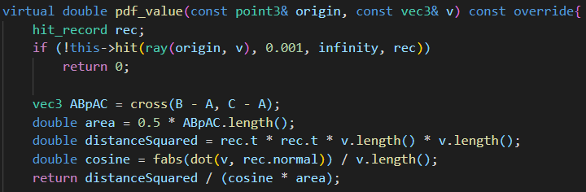

现在解决了三角形光源的问题之后，就是怎么根据输入的点$(x_1,x_2,...,x_n)$来正确的生成三角形了；

我使用的方法是生成$(x_1,x_2,x_3),(x_1,x_3,x_4),...,(x_1,x_{n-1},x_n)$这些三角形来构成多边形，六边形情况如下图：

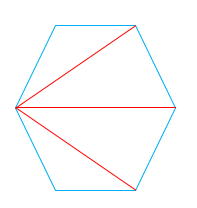

这部分存在的问题是可能三角形的法相是反的，产生的错误效果就是光源变成了黑色；

### 圆形光源的光源采样

圆形光源采样第一次实验的时候就已经实现，采样的公式如下：
$$
r=\sqrt{random\_uniform(0,1)}\\
\theta = random\_uniform(0,2\pi)\\
OP\_unit=vertical\_unit\_vector(N)\\
OQ\_unit=cross(N)\\
randompoint=center+r*cos(theta)*OP_unit+r*sin(theta)*OQ\_unit;
$$
PDF的计算方法如下：

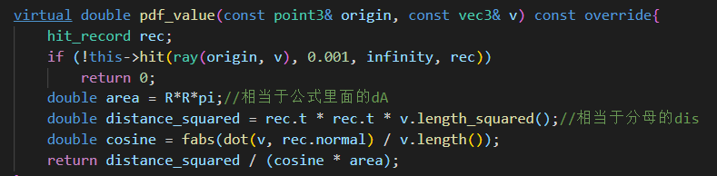

### Microfacet BRDF实现

这部分实现比较困难，我学习了GAMES101的Lecture13-17再次加深了BRDF的概念，参考了[Article - Physically Based Rendering - Cook–Torrance](http://www.codinglabs.net/article_physically_based_rendering_cook_torrance.aspx )以及文献Microfacet Models for Refraction through Rough Surfaces；

首先要考虑的现实问题是这部分应该放在现有框架的位置；

main函数中ray_color的部分如下图，其中attenuation可以理解为颜色，pdf_val是混合PDF计算出来的值，由于attenuation计算的时候实际上还没有生成scattered也就是随机往外的光线的方向，因此BRDF实际上应该实现在$scattering\_pdf$模块里面；

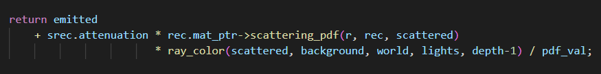

这个模块的位置在material里面，因此我新建了一个叫做microfacet的material来进行这块的工作；

现在考虑Cook-Torrance BRDF方程：

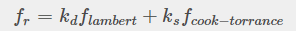

其中$k_d.k_s$实际上是颜色，在我的实现中，这两种颜色一样（实际上就是attenuation里面记录的颜色），因此$scattering\_pdf$里面现在需要计算的值是$f_{ lambert}+f_{cook-toorance}$；

前者表示的是macrosurface，相当于是那种flat & rough的面；后者表示的是bumpy & specular的microscale；

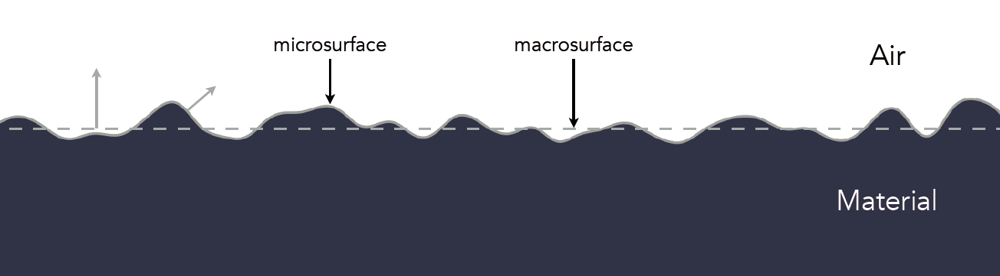

$f_{ lambert}$这部分的计算比较简单，照搬之前lambert材质的实现就行了：

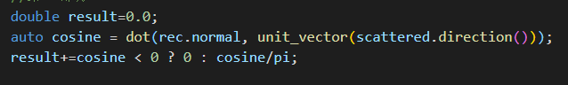

$f_{cook-toorance}$比较复杂，最基本的公式如下图：

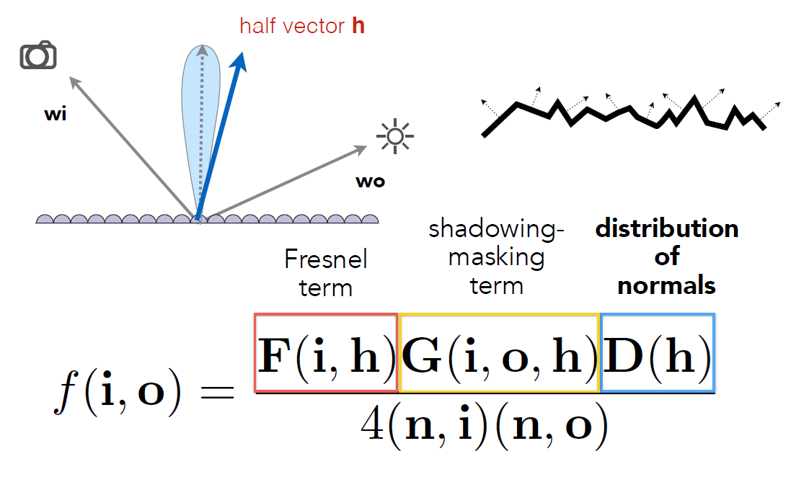

其中h表示的是入射和初始光线相加之后得到的”中间“向量；这个公式由三个部分组成，分别是F,G,D；

F表示的是菲涅尔项，”菲涅耳函数F用于模拟光以不同角度与表面相互作用的方式。“由于原版的比较复杂，实现中实际上用的是Shlick实现的比较简单的版本：

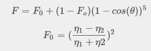

”几何函数G用于描述由于微小平面相互阴影而导致的光衰减。这又是一个统计近似值，它模拟了在给定点微面被彼此遮挡的概率，或者光线在多个微面上反弹，在此过程中失去能量，然后到达观察者的眼睛。“这部分使用的是GGX函数：

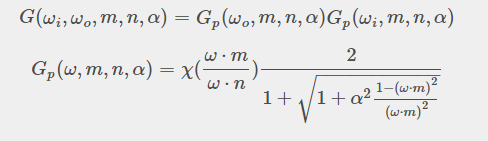

""分布函数D用于描述微观面在某个给定点的统计方向。例如，如果 20% 的分面朝向某个向量 m，则将 m 馈送到分布函数中将得到 0.2。文献中有几个函数来描述这种分布（例如 Phong 或 Beckmann），但是我们将用于分布的函数将是 GGX ”，其定义如下：

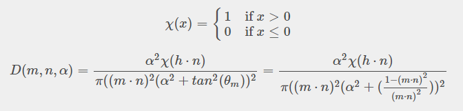

这三个函数最终我在框架中进行了实现，这里需要注意入射光线和出射光线的方向问题，如果没有考虑或者调试的话会造成奇怪的阴影效果，错误版本如下图：

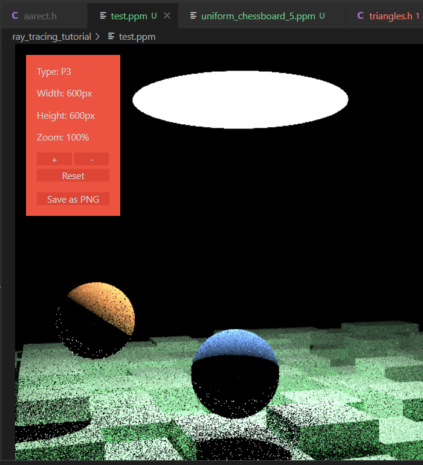

最后我成功进行了BRDF这部分的实现，上图的正确版本如下：

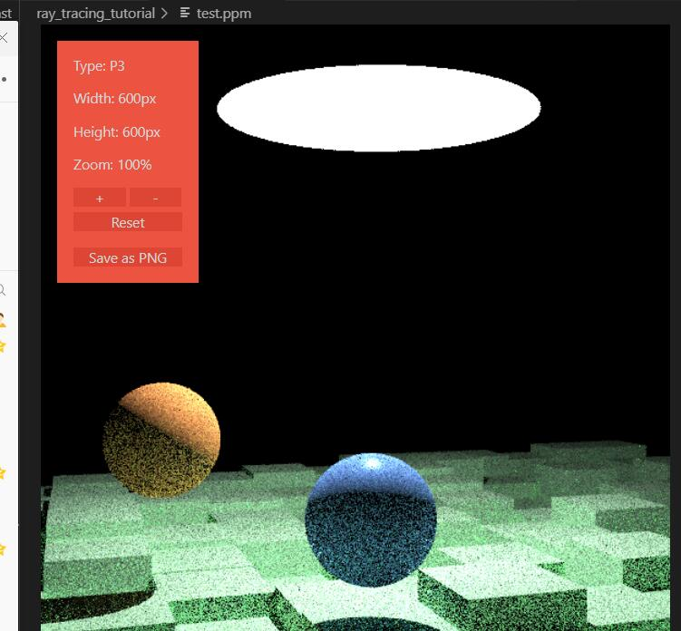

### 混合PDF实现

我在作业一的时候就实现了混合的PDF的实现，目前混合的比例是0.5：

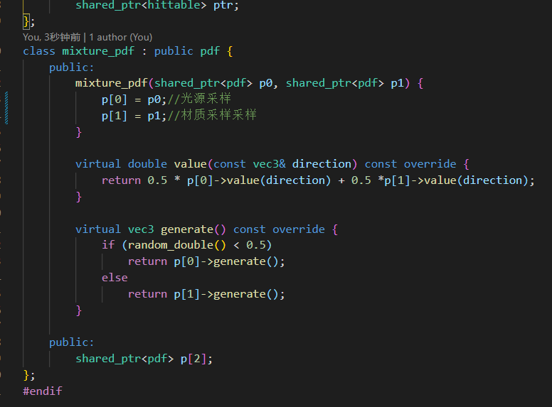

### 最终实现效果

100采样

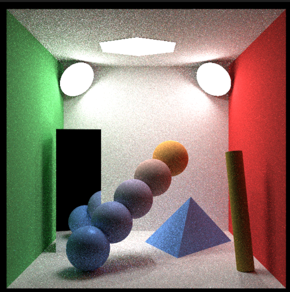

1000采样

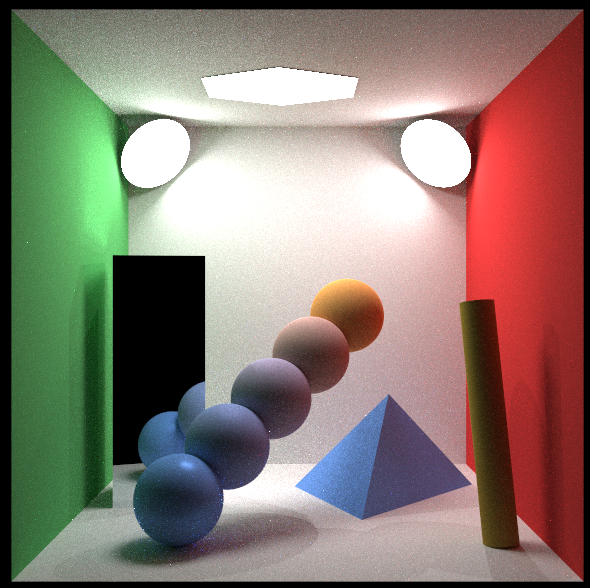

其中小球从下到上Microfast的粗糙度参数是0.1,0.3,0.5,0.7,0.9;因此是越来越粗糙；另外其他的除了镜面之外的材质的粗糙度都是0.6；

